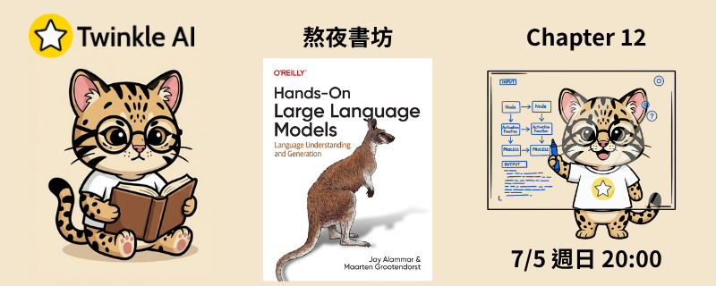

# Chapter 12: 微調生成模型 (Fine-tuning Generation Models)

- **日期：** 2026-07-05
- **內容：** 探索以兩階段方法微調生成式大型語言模型，先透過監督式微調學會指令跟隨，再以偏好對齊技術讓輸出更貼近人類偏好。

## 本章重點

### 監督式微調（Supervised Fine-Tuning, SFT）

- **資料前處理**：使用 `HuggingFaceH4/ultrachat_200k` 資料集，透過 `TinyLlama/TinyLlama-1.1B-Chat-v1.0` 的聊天模板（`<|user|>` / `<|assistant|>`）格式化訓練樣本
- **模型量化（QLoRA）**：以 `BitsAndBytesConfig` 對 `TinyLlama-1.1B-intermediate-step-1431k-3T` 進行 4-bit（NF4）量化載入，搭配巢狀量化降低記憶體用量
- **LoRA 設定**：`r=64`、`lora_alpha=32`、`lora_dropout=0.1`，作用於 `q_proj`、`k_proj`、`v_proj`、`o_proj`、`gate_proj`、`up_proj`、`down_proj` 等注意力與前饋層
- **訓練設定**：`paged_adamw_32bit` 最佳化器、學習率 `2e-4`、cosine 排程、`fp16` 混合精度並開啟 gradient checkpointing
- **合併與推論**：訓練完成後將 LoRA adapter 與基底模型合併（`merge_and_unload`），以指令模板測試微調後的生成效果

### 偏好調校（Preference Tuning, DPO/PPO）

- **資料前處理**：使用 `argilla/distilabel-intel-orca-dpo-pairs` 資料集，過濾掉平手（tie）樣本並僅保留 `chosen_score >= 8` 的高品質偏好對，組成 prompt / chosen / rejected 三元組
- **模型量化與 LoRA**：沿用與 SFT 階段相同的 QLoRA 量化與 LoRA 設定，在 SFT 後的模型基礎上繼續訓練
- **訓練設定**：以 `DPOConfig` 設定學習率 `1e-5`、`max_steps=200`、warmup ratio `0.1`，並以 `beta=0.1` 控制偏好對齊強度
- **訓練與比較**：透過 `DPOTrainer` 進行直接偏好優化（DPO），儲存偏好對齊後的 adapter，並與 SFT 模型的生成結果進行比較

## 資源

- [簡報](Twinkle-llm-book-ch12.pdf) | [Notebook](Chapter%2012%20-%20Fine-tuning%20Generation%20Models.ipynb)
