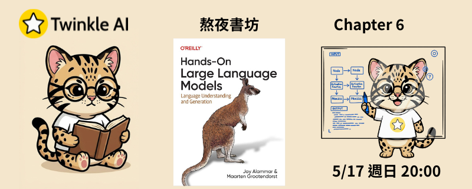

# Chapter 6: 提示工程 (Prompt Engineering)

- **日期：** 2026-05-17
- **內容：** 直擊 LLM 核心，解密提示工程的關鍵技巧，從基礎指令到複雜邏輯推理，全面掌握引導模型產出高品質結果的訣竅。
- **實作：** [官方 Notebook](Chapter%206%20-%20Prompt%20Engineering.ipynb)

## 本章重點

### 駕馭隨機與創造力

- **Temperature**：控制模型輸出的隨機程度，數值越高輸出越多樣，數值越低輸出越穩定集中
- **Top_p（Nucleus Sampling）**：依機率累積門檻篩選候選 Token，與 Temperature 搭配使用可精準平衡創意與穩定性

### 模組化 Prompt 框架

| 元素 | 說明 |
| --- | --- |
| **Persona** | 賦予模型特定角色或專業身份，引導輸出風格與知識範疇 |
| **Context** | 提供任務背景資訊，讓模型理解問題所在的情境與約束 |
| **Format** | 指定輸出格式（如條列、表格、JSON），提升結果可用性 |
| **Tone** | 設定語氣（正式、親切、專業），確保輸出符合目標受眾 |

### 喚醒 System 2 邏輯推理

- **In-Context Learning（ICL）**：透過在提示中嵌入少量範例（Few-shot），引導模型類推並輸出符合預期格式的結果
- **Chain-of-Thought（CoT，思維鏈）**：要求模型逐步展示推理過程，大幅提升複雜數學與邏輯任務的準確率
- **Tree-of-Thought（ToT，思維樹）**：將問題分解為多條推理路徑並行探索，再從中選取最佳解，適合需要回溯與規劃的難題

### 輸出驗證與格式約束

- **結構化輸出（Structured Output）**：透過提示工程或原生 API 功能引導模型穩定輸出 JSON 等結構化格式，便於下游程式直接解析
- **受限採樣（Constrained Sampling）**：在 Token 生成層面強制篩除不符合格式的候選，確保輸出在 Production 環境100% 合規

## 資源

- [官方 Notebook](Chapter%206%20-%20Prompt%20Engineering.ipynb)
