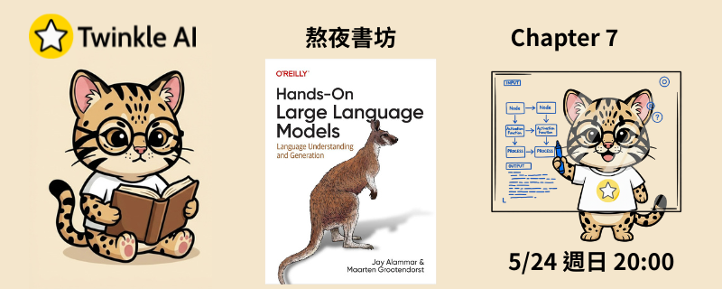

# Chapter 7: 進階文本生成技術與工具 (Advanced Text Generation Techniques and Tools)

- **日期：** 2026-05-24
- **內容：** 超越提示工程，深入探索 LLM 應用開發的三大核心支柱，學習如何將語言模型整合進複雜的工作流程。

## 本章重點

### 載入與串接 LLM（Chains）

- **載入 LLM**：掌握如何載入本地或雲端語言模型，統一介面以便後續流程整合
- **Chain**：將 Prompt 模板、模型推論與後處理步驟串接成可重複使用的自動化流水線
- **Multiple Chains**：組合多個 Chain 形成複雜的處理邏輯，例如先分類再生成、或多階段摘要任務

### 對話記憶管理（Memory）

| 記憶類型 | 說明 |
| --- | --- |
| **ConversationBuffer** | 完整保留所有對話歷史，上下文最豐富但 Token 消耗隨對話增長而累積 |
| **ConversationBufferMemoryWindow** | 以滑動視窗僅保留最近 N 輪對話，在記憶長度與成本之間取得平衡 |
| **ConversationSummary** | 以 LLM 自動摘要壓縮歷史對話，適合長時間對話場景，大幅降低 Token 用量 |

### 自主行動的 Agent

- **Agent 運作循環**：LLM 自主決策、選用工具、觀察結果，並根據回饋迭代直到完成任務（Reason → Act → Observe）
- **工具呼叫（Tool Use）**：賦予 Agent 搜尋網路、執行程式碼、查詢資料庫等外部能力，突破純文字生成的限制
- **多步驟任務規劃**：Agent 能分解複雜目標為可執行子任務，並動態調整策略以應對中間結果

## 資源

- [簡報](Twinkle-llm-book-ch7.0.0.pdf) | [Notebook](Chapter%207%20-%20Advanced%20Text%20Generation%20Techniques%20and%20Tools.ipynb)
