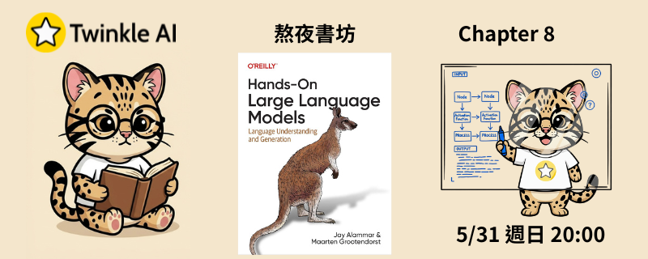

# Chapter 8: 語意搜尋與檢索增強生成 (Semantic Search and Retrieval-Augmented Generation)

- **日期：** 2026-06-07
- **內容：** 深入探索 LLM 的關鍵能力——搜尋與檢索，學習如何讓語言模型根據外部知識庫生成有據可查的答案。

## 本章重點

### 稠密檢索（Dense Retrieval）

- **文本向量化（Embedding）**：將文字區塊轉換為高維向量表示，捕捉語意而非關鍵字匹配
- **向量索引（FAISS）**：建立高效的向量搜尋索引，透過餘弦相似度或 L2 距離快速找出最相近的文件片段
- **語意搜尋流程**：將查詢向量化後，在索引中檢索最近鄰，實現超越關鍵字的語意層次匹配

### 詞彙搜尋（Lexical Search）

| 方法 | 說明 |
| --- | --- |
| **BM25** | 基於詞頻與逆文件頻率的傳統稀疏檢索，速度快、不需要 GPU，但無法理解語意同義詞 |
| **Dense Retrieval** | 利用嵌入模型捕捉語意相似性，能處理改述與同義詞，但對超出訓練分佈的查詢可能失準 |

### 重排序（Reranking）

- **兩階段檢索架構**：先以 BM25 或向量搜尋快速召回候選文件，再以更精準的重排序模型重新排列結果
- **Cohere Rerank API**：使用交叉編碼器（Cross-Encoder）對查詢與每份文件進行逐一比對，顯著提升排序品質
- **混合搜尋（Hybrid Search）**：結合詞彙搜尋與語意搜尋的優勢，並搭配重排序取得最佳結果

### 檢索增強生成（RAG）

- **RAG 核心流程**：檢索相關文件片段 → 將文件注入提示詞 → 由 LLM 依據文件生成有引用依據的回答
- **有根據的生成（Grounded Generation）**：透過 Cohere Chat API 實現帶有文件引用的回答，減少幻覺
- **本地 RAG 管線**：結合 LlamaCpp（Phi-3）、HuggingFace 嵌入模型與 FAISS 向量資料庫，打造完全離線的 RAG 系統

## 資源

- [簡報](Twinkle-llm-book-ch8.pdf) | [Notebook](Chapter%208%20-%20Semantic%20Search.ipynb)
