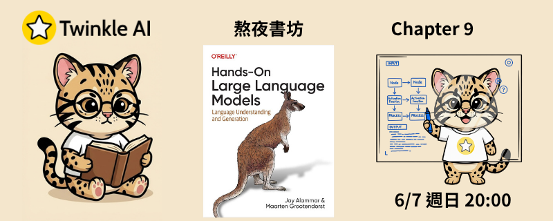

# Chapter 9: 多模態大型語言模型 (Multimodal Large Language Models)

- **日期：** 2026-06-07
- **內容：** 探索如何為語言模型加入視覺能力，學習多模態嵌入、圖像描述生成與視覺問答等核心技術。

## 本章重點

### CLIP（對比式語言-圖像預訓練）

- **多模態嵌入（Multimodal Embeddings）**：將圖像與文字映射至同一向量空間，實現跨模態的語意相似度比較
- **圖像-文字匹配**：透過餘弦相似度衡量圖像與描述之間的關聯程度，支援零樣本圖像分類
- **SBERT 整合**：結合句子嵌入模型，進一步強化文字端的語意表示能力

### BLIP-2（語言-圖像預訓練 2）

| 使用情境 | 說明 |
| --- | --- |
| **圖像描述生成（Image Captioning）** | 模型依據輸入圖像自動生成自然語言描述，無需額外文字提示 |
| **視覺問答（Visual Question Answering）** | 結合圖像與問題文字，由模型推理並回答與圖像內容相關的問題 |

- **圖像前處理**：使用處理器將原始圖像轉換為模型可接受的張量格式
- **文字前處理**：將問題文字 tokenize 後與圖像特徵一同輸入模型，實現跨模態推理

## 資源

- [簡報](Twinkle-llm-book-ch9.pdf) | [Notebook](Chapter%209%20-%20Multimodal%20Large%20Language%20Models.ipynb)
